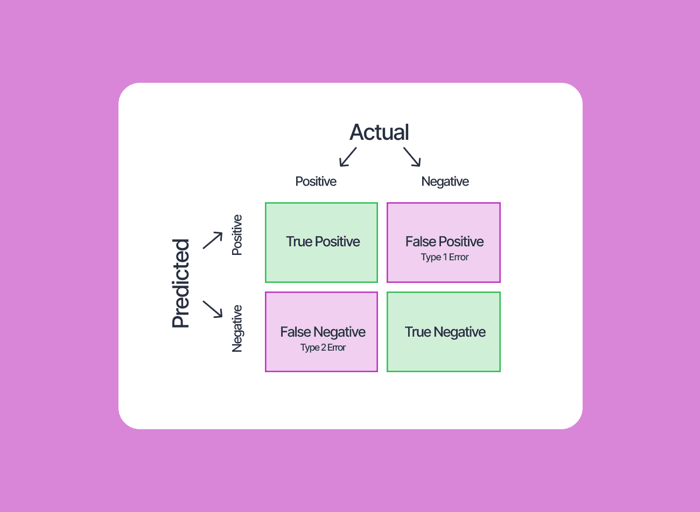
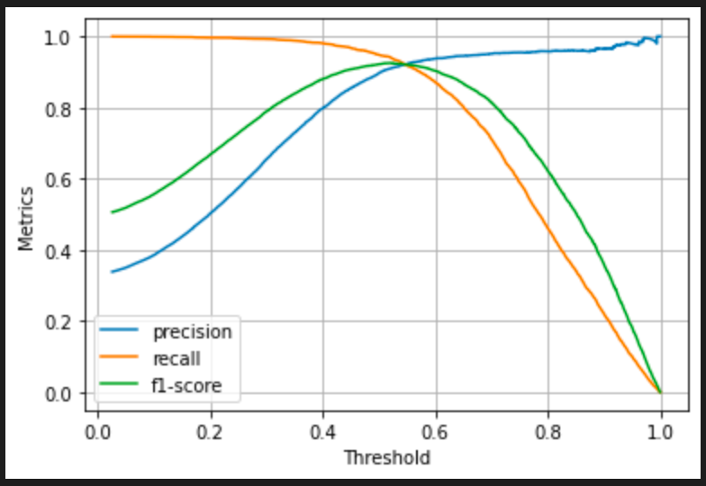
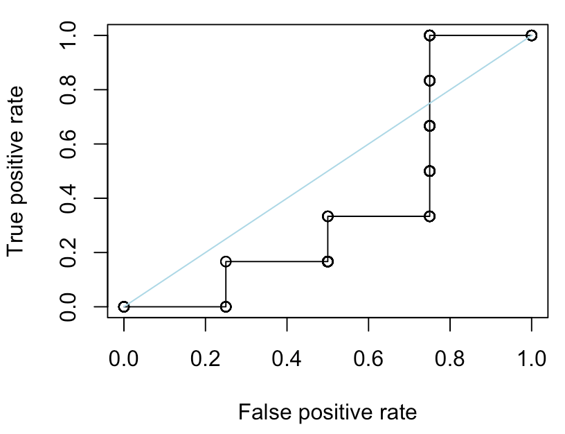

# Метрики качества бинарной классификации

**Предмет:** обработка больших объемов данных
**Дата:** 2025-09-23

## 🎯 Основные понятия
- **Бинарная классификация** — задача, в которой модель относит объекты к одному из двух классов (положительный/отрицательный).
- **Confusion matrix (матрица ошибок)** — таблица из четырёх ячеек: True Positive (TP), False Positive (FP), False Negative (FN), True Negative (TN), описывающая распределение правильных и ошибочных предсказаний.
- **Accuracy (точность классификации)** — доля правильных предсказаний: $\text{Accuracy} = \dfrac{TP + TN}{TP + FP + FN + TN}$.
- **Precision (точность, PPV)** — доля истинно положительных среди всех предсказанных положительных: $\text{Precision} = \dfrac{TP}{TP + FP}$.
- **Recall (полнота, TPR)** — доля найденных положительных объектов: $\text{Recall} = \dfrac{TP}{TP + FN}$.
- **False Positive Rate (FPR)** — доля ложно положительных среди реальных отрицательных: $\text{FPR} = \dfrac{FP}{FP + TN}$.
- **F1-score** — гармоническое среднее Precision и Recall: $F_1 = 2 \cdot \dfrac{\text{Precision} \cdot \text{Recall}}{\text{Precision} + \text{Recall}}$.
- **ROC-кривая** — график зависимости TPR от FPR при изменении порога классификации.
- **PR-кривая** — график зависимости Precision от Recall; информативна на несбалансированных выборках.
- **AUC (Area Under Curve)** — площадь под ROC- или PR-кривой, агрегирует качество модели во всех порогах.
- **Бизнес-метрика** — доменная метрика, измеряющая бизнес-эффект решений (прибыли, затраты, удержание клиентов и др.).

## 📚 Теоретическая часть
### 🔢 Матрица ошибок и ключевые выводы
Матрица ошибок формируется подсчётом совпадений между истинными метками и ответами модели. Она позволяет вывести любые агрегированные показатели качества. Например, accuracy подходит для сбалансированных классов, но теряет информативность, когда отрицательных примеров значительно больше.

### 🎚️ Порог и вероятностные предсказания
Современные модели (логистическая регрессия, градиентный бустинг) прогнозируют вероятность принадлежности объекта к классу. Чтобы получить бинарное решение, задаётся порог $p^*$. Изменяя порог, мы перемещаемся по ROC- и PR-кривым, балансируя между полнотой и точностью. Низкий порог увеличивает Recall, но повышает FP и снижает Precision; высокий порог действует наоборот.

### 📈 ROC-кривая
ROC-кривая строится по парам $(\text{FPR}(p), \text{TPR}(p))$ для порогов $p \in [0, 1]$. Линия $\text{TPR} = \text{FPR}$ соответствует случайному классификатору. Чем выше кривая над диагональю, тем лучше модель. AUC-ROC интерпретируется как вероятность, что случайно выбранный положительный объект получит больший скор, чем отрицательный. На разбалансированных данных ROC может переоценивать качество, потому что FPR чувствителен к числу отрицательных примеров.

### 📉 PR-кривая
PR-кривая отслеживает компромисс между Precision и Recall. Она особенно полезна, когда положительный класс редкий: даже небольшое увеличение FP заметно снижает Precision. Площадь под PR-кривой (Average Precision) показывает среднюю точность при росте полноты. На практике сравнивают модели по AUC-PR или по фиксированным точкам (например, минимально приемлемый Recall).

### ⚖️ Выбор метрики под задачу
- Если важно не пропустить положительные события (медицина, антифрод) — оптимизируют Recall и ограничивают FPR.
- Для задач, где ложные срабатывания дороги (email-спам, бан аккаунтов) — контролируют Precision.
- F1-score уравновешивает точность и полноту, но может скрывать дисбаланс. Для иных приоритетов используют взвешенное $F_{\beta}$.
- Бизнес-метрики формализуют стоимость ошибок. Например, задают цену FP и FN и выбирают порог, максимизирующий ожидаемую прибыль.

## 💡 Примеры
1. **Матрица ошибок на тесте (100 объектов):** модель верно определила 40 из 50 положительных (TP=40) и 45 из 50 отрицательных (TN=45), допустив 5 FP и 10 FN. Тогда:
   - Accuracy = $(40 + 45)/100 = 0{,}85$.
   - Precision = $40/(40 + 5) = 0{,}89$.
   - Recall = $40/(40 + 10) = 0{,}80$.
   - F1 ≈ $2 \cdot 0{,}89 \cdot 0{,}80 / (0{,}89 + 0{,}80) = 0{,}84$.
   Такой разбор показывает, что высокая точность достигается ценой 10 пропущенных положительных.
2. **Влияние порога:** при пороге 0.3 модель ловит 48 положительных (Recall=0.96), но получает 20 FP (Precision падает до 0.71). При пороге 0.7 Precision растёт до 0.93, однако Recall падает до 0.54. Выбор зависит от бизнес-ценности дополнительных True Positive.
3. **Сравнение моделей по ROC-AUC:** Модель A имеет AUC-ROC = 0.91, модель B — 0.87. Однако при Recall ≥ 0.9 Precision модели B выше. Для высокорискованных задач предпочтительнее B, даже при меньшем AUC-ROC.

## 🔗 Связанные темы
- [Градиентный бустинг](./2025-10-14_градиентный-бустинг.md)
- [Операции с матрицами](../../math/2025-09-26_matrices-operations.md)

## ❓ Вопросы для самопроверки
1. Как из матрицы ошибок вывести формулы Precision, Recall и FPR? Какие предположения при этом делаются?
2. Почему ROC-кривая может вводить в заблуждение на сильно несбалансированных данных и когда лучше смотреть PR-кривую?
3. Как задать бизнес-метрику для выбора оптимального порога классификации? Приведите пример из вашей предметной области.
4. В каких случаях $F_{\beta}$-метрика предпочтительнее классического F1 и как подобрать параметр $\beta$?
5. Как интерпретировать площадь под ROC-кривой с точки зрения вероятностных предсказаний модели?

## 📖 Дополнительные материалы
- Aurélien Géron. "Hands-On Machine Learning with Scikit-Learn, Keras & TensorFlow", гл. 3.
- Fawcett T. "An introduction to ROC analysis", Pattern Recognition Letters, 2006.
- Статья Google Developers "Precision and recall" (Machine Learning Crash Course).
