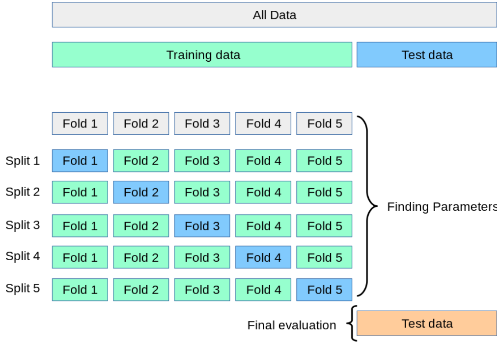
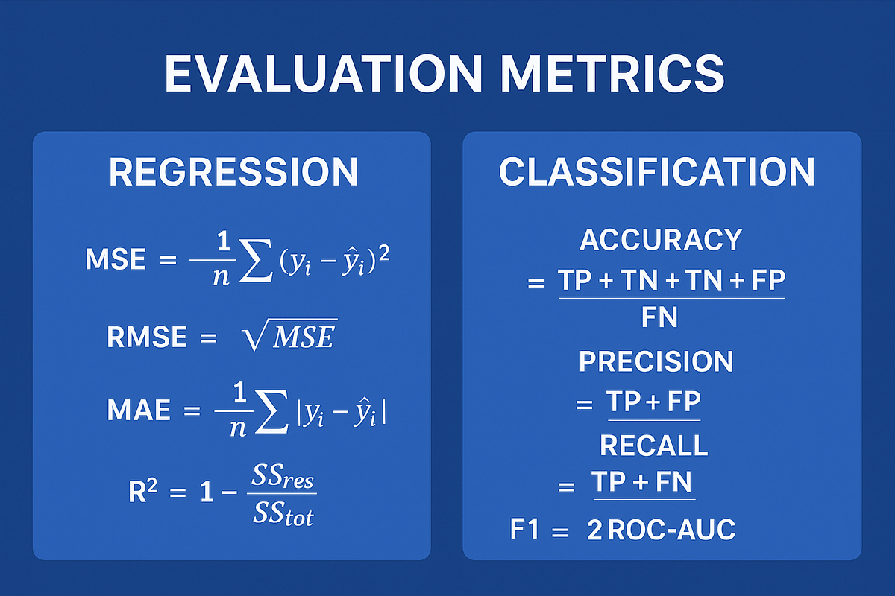
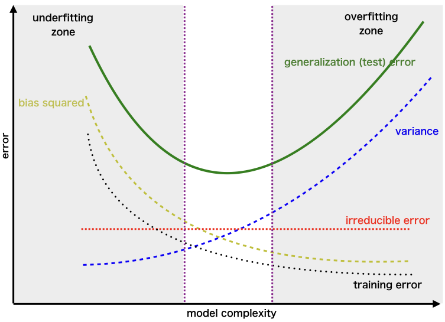

# Оценка качества моделей и контроль переобучения

**Предмет:** обработка больших объёмов данных  
**Дата:** 2025-10-07  
**Статус:** ✅ Изучено

## 🎯 Основные понятия
- **Обучающая, валидационная и тестовая выборки** — независимые подмножества данных для обучения модели, настройки гиперпараметров и финальной проверки обобщающей способности.
- **Ошибка модели** — отклонение предсказаний от истинных значений; может измеряться средними абсолютными, квадратичными или процентными метриками.
- **MAE (Mean Absolute Error)** — средняя абсолютная ошибка, устойчива к выбросам.
- **MSE (Mean Squared Error)** и **RMSE (Root MSE)** — средняя квадратичная ошибка и её корень, сильнее наказывают крупные ошибки.
- **MAPE (Mean Absolute Percentage Error)** — средняя абсолютная процентная ошибка, выражает относительное отклонение.
- **Bias (смещение)** — систематическое отклонение средних предсказаний модели от истинной зависимости.
- **Variance (разброс)** — чувствительность модели к конкретной обучающей выборке.
- **Irreducible error (неустранимая ошибка)** — шум данных, который нельзя устранить моделью.

## 📚 Теоретическая часть
1. **Разбиение данных**
   - При обработке больших наборов данных стандартная схема: 60–70% данных — обучение, 15–20% — валидация, остальное — тест.
   - Дополнительно применяют `k`-кратную кросс-валидацию: выборка делится на `k` блоков, каждый блок по очереди играет роль валидации, а остальные — обучение.

   

2. **Метрики качества регрессии**
   - $$\mathrm{MAE} = \frac{1}{n}\sum_{i=1}^n |y_i - \hat{y}_i|$$
   - $$\mathrm{MSE} = \frac{1}{n}\sum_{i=1}^n (y_i - \hat{y}_i)^2,\quad \mathrm{RMSE} = \sqrt{\mathrm{MSE}}$$
   - $$\mathrm{MAPE} = \frac{100\%}{n}\sum_{i=1}^n \left|\frac{y_i - \hat{y}_i}{y_i}\right|$$ (использовать только при положительных `y_i`).
   - Для сравнения моделей важно одинаковое масштабирование признаков и идентичные выборки.

   

3. **Разложение общей ошибки**
   - Ожидаемая квадратичная ошибка модели:
     $$\mathbb{E}\big[(y - \hat{f}(x))^2\big] = \operatorname{Bias}[\hat{f}(x)]^2 + \operatorname{Var}[\hat{f}(x)] + \sigma^2,$$
     где \(\sigma^2\) — неустранимая ошибка.
   - **Низкое смещение, высокая дисперсия** — переобучение (overfitting), модель подстраивается под шум.
   - **Высокое смещение, низкая дисперсия** — недообучение (underfitting), модель слишком проста.

4. **Кривая ошибки vs сложность модели**
   - При увеличении сложности модели обучающая ошибка монотонно уменьшается.
   - Валидационная ошибка сначала падает, а затем растёт — появляется точка минимальной суммарной ошибки, оптимальная сложность.
   - Управление сложностью: регуляризация (L1/L2), ограничение глубины деревьев, ранняя остановка, отбор признаков.

   

5. **Практические техники контроля качества**
   - Повторяемые эксперименты с разными seed (set random state) для оценки разброса.
   - Использование бутстрепа для оценки доверительных интервалов метрик.
   - Мониторинг метрик в динамике по батчам данных в потоковых системах.

## 💡 Примеры
- **Расчёт MAE и RMSE**: для истинных значений \([8, 10, 12]\) и предсказаний \([9, 9, 15]\) получаем \(\mathrm{MAE} = \frac{|8-9| + |10-9| + |12-15|}{3} = 1.67\), \(\mathrm{RMSE} = \sqrt{\frac{1^2 + 1^2 + 3^2}{3}} \approx 2.16\).
- **5-кратная кросс-валидация**: делим выборку на 5 блоков, обучаем 5 моделей, каждый раз оставляя один блок для проверки. Усредняем метрику и анализируем разброс для оценки дисперсии.
- **Bias-Variance trade-off**: линейная модель может иметь Bias \(> 0\), но низкую Variance; ансамбль деревьев наоборот снижает Bias и повышает Variance, поэтому добавляем бустинг с регуляризацией для баланса.

## 🔗 Связанные темы
- [Градиентный бустинг](./2025-10-14_градиентный-бустинг.md)
- [Матрицы и линейные операции](../../math/2025-09-26_matrices-operations.md)

## ❓ Вопросы для самопроверки
1. Чем отличаются обучающая, валидационная и тестовая выборки по назначению?
2. В каких случаях лучше использовать MAE вместо MSE?
3. Какие последствия у высокой дисперсии модели и как её уменьшить?
4. Как работает `k`-кратная кросс-валидация и зачем усреднять метрики?
5. Что обозначает неустранимая ошибка в разложении Bias-Variance?

## 📖 Дополнительные материалы
- [Статья: Bias-Variance Tradeoff — scikit-learn документация](https://scikit-learn.org/stable/auto_examples/model_selection/plot_underfitting_overfitting.html)
- [Курс: Ошибки и оценка моделей на Coursera (ВШЭ)](https://www.coursera.org/learn/vvedenie-mashinnoe-obuchenie)
