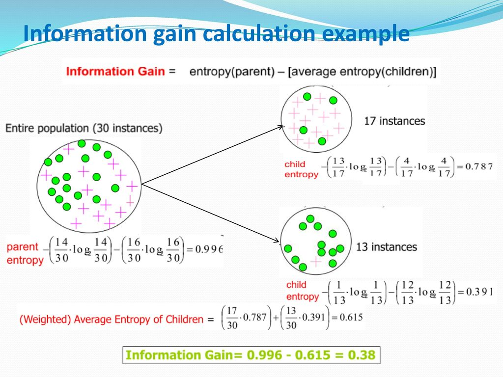
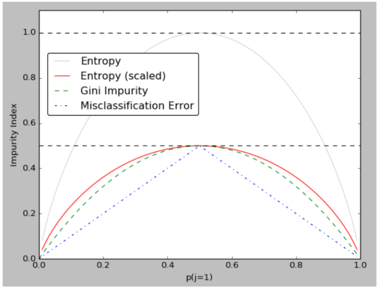
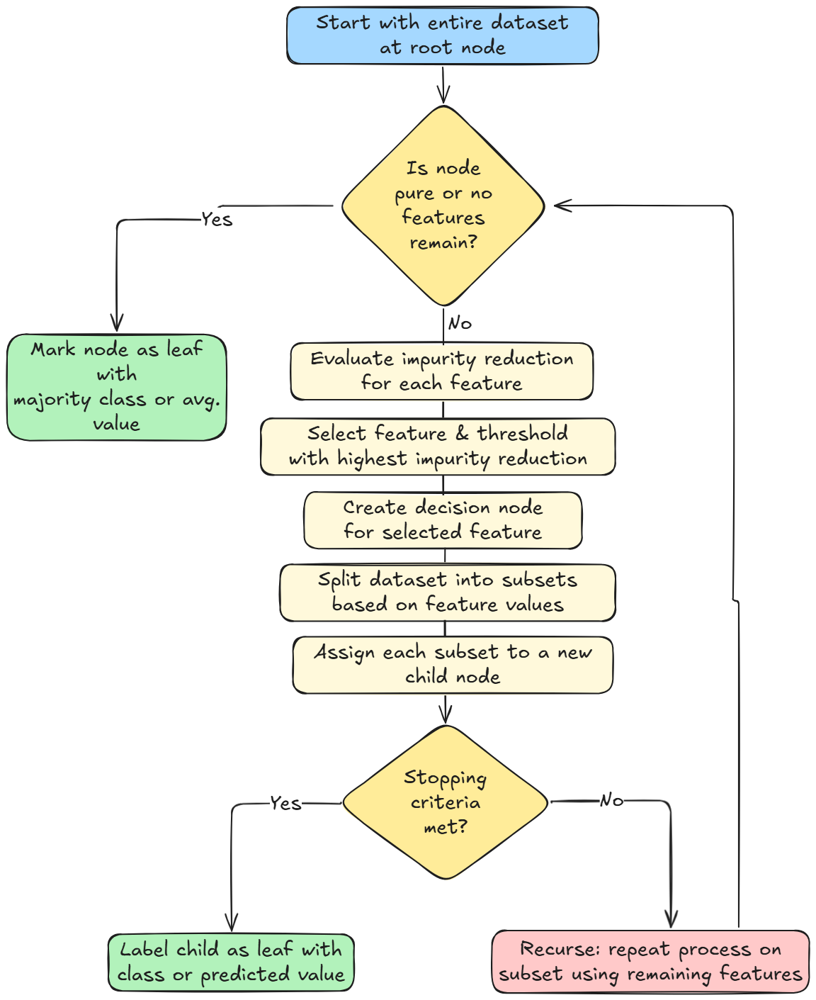

# Построение деревьев решений для анализа больших объёмов данных

**Предмет:** Обработка больших объёмов данных  
**Дата:** 2025-10-30

## 🎯 Основные понятия
- **Дерево решений** — иерархическая структура, где внутренние узлы соответствуют проверкам признаков, ветви — исходам проверки, а листья — финальным прогнозам класса или числового значения.
- **Признак (атрибут)** — столбец в обучающей выборке, по которому выполняется разделение примеров на узлах дерева.
- **Чистота узла** — степень однородности примеров в подмножестве; максимальна, когда в узле остались объекты одного класса.
- **Энтропия Шеннона** — мера неопределённости распределения классов: $$H(S) = -\sum_i p_i \log_2 p_i$$.
- **Прирост информации** — уменьшение энтропии после разбиения по признаку: $$IG(S, A) = H(S) - H(S\mid A)$$.
- **Переобучение** — ситуация, когда дерево слишком точно подстраивается под обучающие данные и плохо обобщает на новых примерах; для борьбы используют ограничения глубины и обрезку ветвей.

## 📚 Теоретическая часть
1. **Постановка задачи.** Дано множество объектов $S$ с классами $y \in \{0,1, \ldots, K\}$. Требуется построить дерево, минимизирующее ошибку классификации и позволяющее интерпретировать логику решений.

   
2. **Алгоритм построения (ID3/C4.5):**
   - Вычислить исходную энтропию $H(S)$.
   - Для каждого признака $A$ рассчитать условную энтропию $H(S\mid A)$ как взвешенную сумму энтропий разбиений.
   - Выбрать признак с максимальным приростом информации $IG$ (или альтернативный критерий, например коэффициент прироста $GainRatio = IG / H(A)$).
   - Создать дочерние узлы для всех значений признака и рекурсивно повторить шаги, пока узлы не станут чистыми или пока не выполнится условие остановки (ограничение глубины, минимальный размер листа и др.).
3. **Альтернативные критерии качества разбиений.**
   - **Индекс Джини:** $$Gini(S) = 1 - \sum_i p_i^2$$ — хорошо работает для двоичной классификации, менее чувствителен к редким классам.
   - **Критерий ошибки классификации:** $Error(S) = 1 - \max_i p_i$, используется на стадии обрезки из-за простоты.

   
4. **Обрезка (pruning):**
   - **Предварительная** — ограничение роста дерева (глубина, минимальное число объектов в узле, минимальный прирост информации).
   - **Последующая** — построение полного дерева и последующее удаление ветвей, которые не улучшают качество на валидационном наборе (например, метод уменьшения ошибок или cost-complexity pruning).

   
5. **Работа с большими данными.**
   - Использование выборки (bootstrap, случайные мини-батчи) при оценке прироста информации.
   - Параллельное вычисление статистик по признакам и распределённое хранение данных.
   - Инкрементальное обновление дерева при поступлении новых данных или переключение на ансамбли деревьев (Random Forest, Gradient Boosting) для устойчивости.

## 💡 Примеры
### Пример 1. Кредитный скоринг
| Клиент | Стабильный доход | История выплат | Запрос кредита |
|--------|------------------|----------------|----------------|
| 1      | Высокий          | Без просрочек  | Одобрен        |
| 2      | Средний          | Просрочки      | Отказ          |
| 3      | Высокий          | Просрочки      | Одобрен        |
| 4      | Низкий           | Без просрочек  | Отказ          |
| 5      | Средний          | Без просрочек  | Одобрен        |
| 6      | Высокий          | Без просрочек  | Одобрен        |
| 7      | Низкий           | Просрочки      | Отказ          |

1. **Исходная энтропия класса.** В выборке 4 одобрения и 3 отказа: $H(S) \approx -\frac{4}{7}\log_2\frac{4}{7} - \frac{3}{7}\log_2\frac{3}{7} \approx 0{,}985$.
2. **Разбиение по признаку «История выплат».**
   - Без просрочек: 4 объекта, из них 3 одобрения и 1 отказ: $H_{без} \approx 0{,}811$.
   - Просрочки: 3 объекта, из них 1 одобрение и 2 отказа: $H_{просрочка} \approx 0{,}918$.
   - Взвешенная энтропия: $H(S\mid \text{История}) = \frac{4}{7} \cdot 0{,}811 + \frac{3}{7} \cdot 0{,}918 \approx 0{,}857$.
   - Прирост информации: $IG = 0{,}985 - 0{,}857 = 0{,}128$.
3. **Разбиение по признаку «Стабильный доход».**
   - Высокий: 3 объекта, все одобрены, $H = 0$.
   - Средний: 2 объекта, 1 одобрение и 1 отказ, $H = 1$.
   - Низкий: 2 объекта, оба отказаны, $H = 0$.
   - Взвешенная энтропия: $H(S\mid \text{Доход}) = \frac{3}{7} \cdot 0 + \frac{2}{7} \cdot 1 + \frac{2}{7} \cdot 0 = 0{,}286$.
   - Прирост информации: $IG = 0{,}985 - 0{,}286 = 0{,}699$ → этот признак становится корнем дерева.
4. **Построение ветвей.** Для значений «Высокий» и «Низкий» создаются листья с решением (все одобрения или все отказы). Для «Средний» требуется дополнительное разбиение, например, по «Истории выплат», чтобы устранить неопределённость.

## 🔗 Связанные темы
- [Градиентный бустинг](./2025-10-14_градиентный-бустинг.md) — ансамблевый метод, использующий деревья решений как базовые модели.
- [Кодирование дискретных источников равномерными кодами](../основы-теории-передачи-информации/2025-09-27_кодирование-дискретных-источников-равномерными-кодами.md) — связь через понятие энтропии и информативности признаков.

## ❓ Вопросы для самопроверки
1. Чем отличаются критерии Джини, энтропия и ошибка классификации при оценке чистоты узла?
2. Почему прирост информации может смещаться в сторону признаков с большим числом уникальных значений и как это компенсировать?
3. Какие приёмы помогают избежать переобучения дерева решений на больших данных?
4. В чём преимущества и недостатки предварительной и последующей обрезки дерева?
5. Как распределённая обработка данных влияет на выбор алгоритма построения дерева решений?

## 📖 Дополнительные материалы
- Mitchell T. "Machine Learning" — глава про деревья решений (ID3, C4.5).
- Hastie, Tibshirani, Friedman. "The Elements of Statistical Learning" — раздел 9 про деревья и ансамбли.
- Видеолекция Яндекса «Деревья решений и меры информативности».
